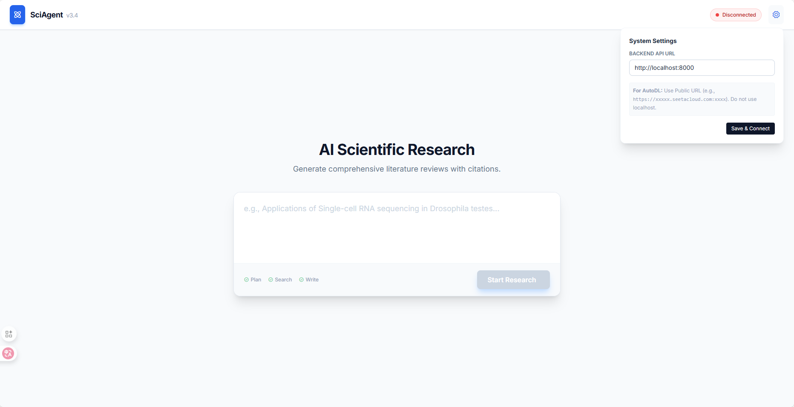
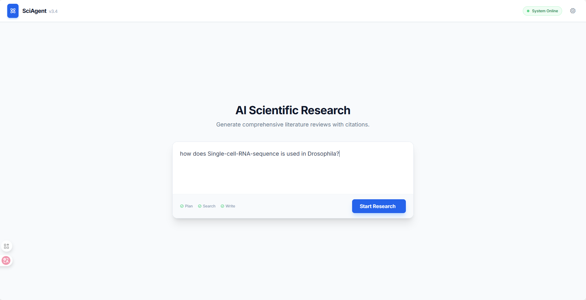
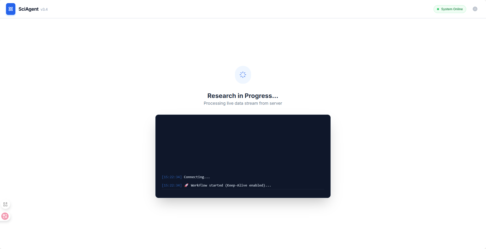
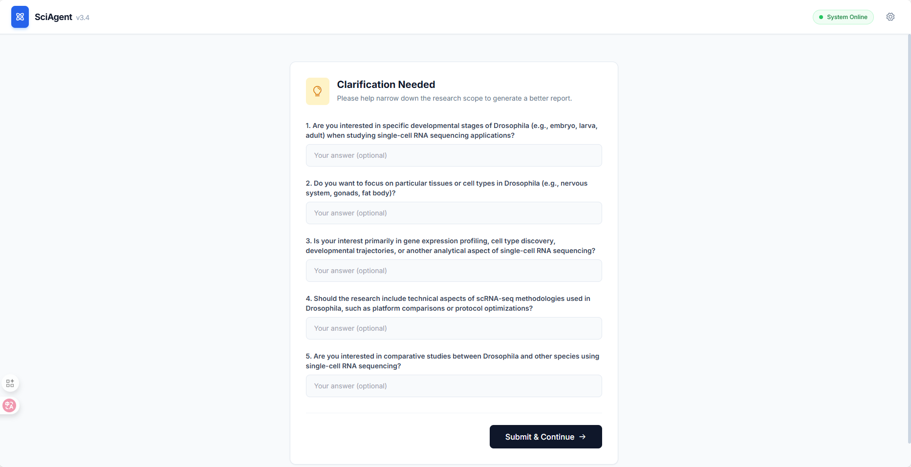
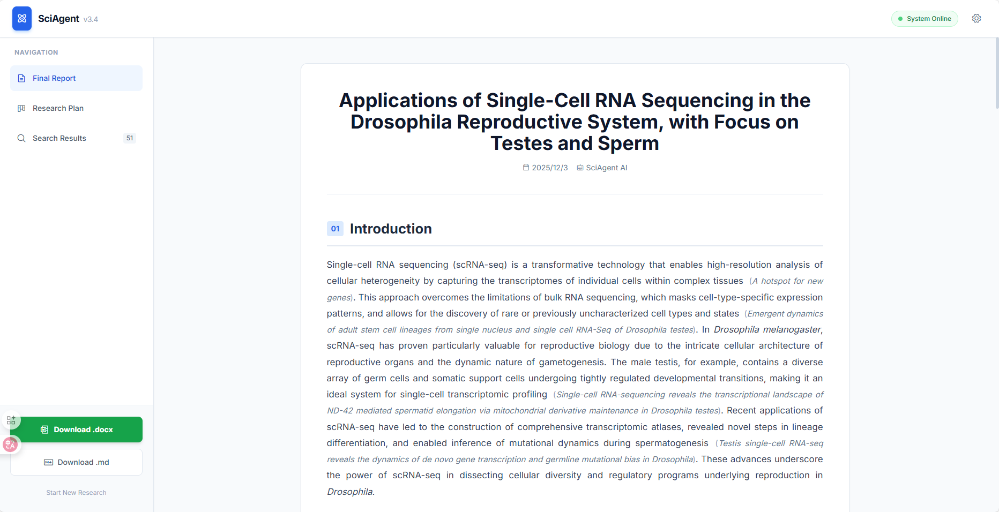
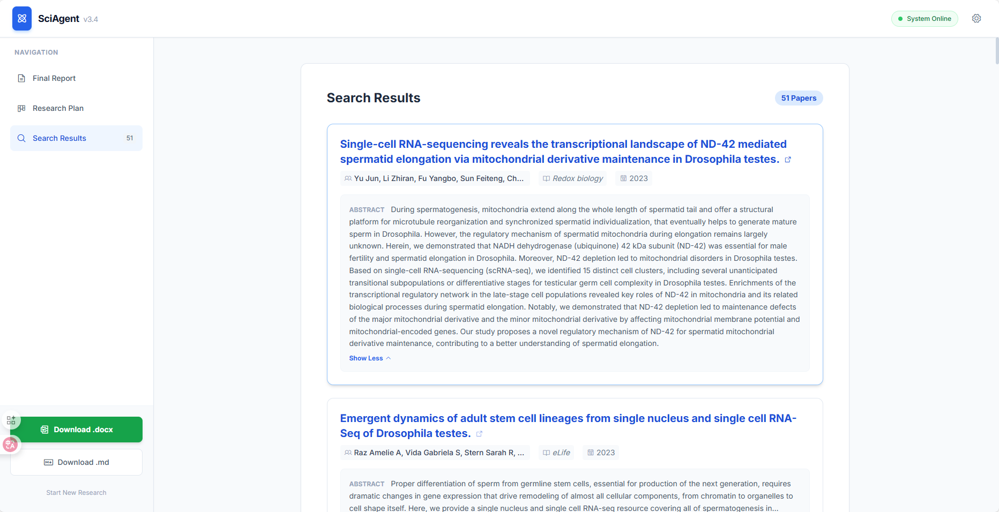

* 项目目前能做到：
  * 用户输入问题/主题，输出关于该问题/主题的综述报
* 目前各agent的功能/职责：
  * plan agent
      * 对用户的问题进行构思，向用户提出需要澄清的问题
      * 根据用户的问题&澄清问题的回答，进行大纲的规划
      * 根据大纲、问题、agent功能等，进行agent任务的规划
  * search agent
    * 根据plan agent派发的search 任务的主题，进行关键词提取
    * 将关键词放到数据库中查询，如果没搜到论文就更改关键词重新查
    * 提取查询到的论文的关键信息
  * embedding
    * 获取查询到的论文的全文信息
    * 将论文嵌入向量数据库
  * writing node
    * question agent
      * 根据大纲每一点的title和content进行提问
    * generate agent
      * 将 questions agent 的问题作为query到向量数据库中进行查询
      * 根据查到的信息，进行段落生成
* 项目不足可以改进的地方
  * plan agent[已更新]
    * 这个项目实际上是个工作流，plan agent实际调用的只有search agent
    * 任务分配阶段，可以只分配search task，好好规划需要search的内容
  * search agent
    * 搜索策略
  * embedding
    * 有些论文获取不了全文，就将search agent获取的abstract摘要嵌入向量数据库[已更新]
    * 嵌入策略[ing]
  * writing node
    * 保存文件[已更新]
      * word and markerdown
    * 下载文件
    * 上下文(段落之间)连贯问题[ing]
      * question agent 提问时，提供背景信息，将所有文章的摘要写进提示词
      * generate agent传入上一个段落的摘要和下一个段落的title/content，让llm生成时需要考虑到过渡逻辑问题

    
    